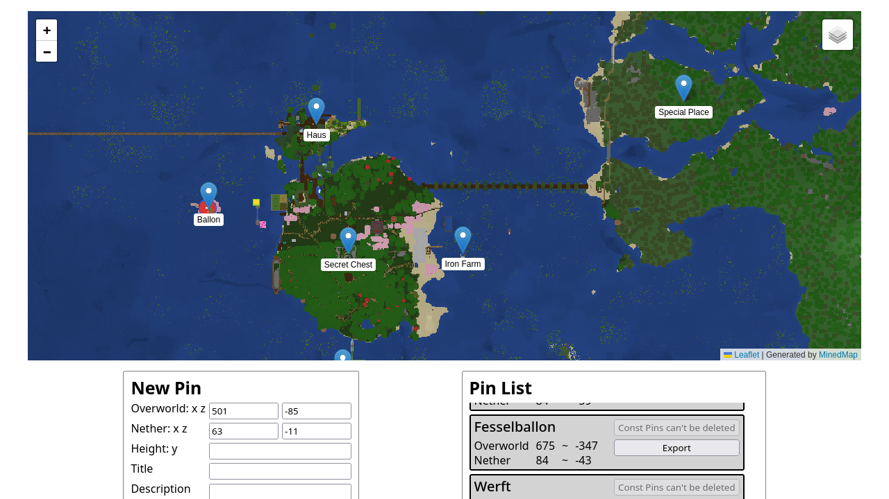

# minecraft_map_marker
A Progressive Web App (PWA) to remember locations on your Minecraft server.

Example deployment: https://map.mc.chris-besch.com

As a server admin you can use [MinedMap](https://github.com/neocturne/MinedMap) to create a map of your world.
This map is what the minecraft_map_marker uses to let your players save pins (location marker on the map).
These pins are stored in the [local storage](https://developer.mozilla.org/en-US/docs/Web/API/Window/localStorage) of the PWA and thus private to each player.

Features:
- **[Const pins](#const-pins)** defined by the server admin
- **Private pin storage** (the minecraft_map_marker is perfect for your secret chest locations)
- Pin **import and export** via the clipboard for easy coordinate sharing
- **Nether/Overworld** coordinate calculator
- **PWA**: Install the minecraft_map_marker on your phone/laptop just as if it where a native app.
- Fully **self-hosted**: No trackers, CDN resources or anything else that could harm the user's privacy

## Project Description

The video game Minecraft allows users to explore three planar virtual worlds;
out of these are the Overworld and Nether of interest.
When a user wants to visit a previously encountered point of interest in the Overworld, she has to remember its coordinates and then travel to it through the Nether.
This is because Overworld coordinates can be mapped to Nether coordinates by a scaling factor of eight;
Nether portals link the Nether and Overworld, allowing the player to travel between them.
For example to travel from the Overworld coordinate (0, 0) to (1000, 1000) the player has to traverse 1414 meters in the Overworld or enter the Nether and travel 177 meters from (0, 0) to (125, 125).

The difficulty lies in placing the exiting Nether portal at the right coordinates so that the corresponding Overworld portal is at the point of interest.
Thus, players have to remember many coordinates and their Nether equivalent.
To solve this, the Web App forms a memory prosthesis by storing these coordinates in the form of pins on an interactive map.
Additionally, the Web App allows for sharing pins between users, easing the coordination of virtual events.

## Software-stack Considerations

The Web App's main component is an interactive map of the Minecraft Overworld.
To improve the maintainability of the Web App a well-supported interactive map library should be chosen.
This library should not rely on third party servers ensuring the app can be used in the future without extensive rework.
As libraries with more users often receive better support, a general purpose map library is preferred over a Minecraft-specific solution.
The Open-Source JavaScript library [Leaflet](https://leafletjs.com/) fulfils these requirements but cannot directly show Minecraft worlds.
MinedMap is used to render a Minecraft world into images to be displayed with Leaflet.com/).

The Web App is developed in TypeScript without any UI frameworks, version controlled through Git and published to GitHub.
As the scope of the app does not require the use of multiple source files, a simple build setup with the TypeScript-CLI without a bundler suffices.
The dependencies are included in the Git repository to provide for a self-contained build environment.

Another significant aspect of the dependency considerations is the deployment environment.
Docker Images are the industry standard for containerized server deployment and many Minecraft servers are already deployed via Docker.
Therefore, the TypeScript-CLI instructions are formulated in a Dockerfile.
This enables the reproducible creation of a Docker Image containing both the static web objects and MinedMap binary.
This MinedMap binary is executed by the [docker_cron](https://github.com/christopher-besch/docker_cron) container, enabling regular map update intervals.

With this software-stack, many of the Web apps functionalities are handled through well-supported libraries, reducing the to be maintained codes' scope.
Additionally, the final Docker Image does not rely on external third-party services, allowing for a dependable and privacy-preserving app.

## Deployment Directly on Host
- install node, npm and the typescript compiler (with `npm install -g typescript`)
- clone the repository and enter the cloned directory
- `npm install` (needed for leaflet types)
- `tsc --build`

All that is left to do is [run MinedMap](https://github.com/neocturne/MinedMap?tab=readme-ov-file#how-to-use) over your Minecraft world and put the output in the `src/data` directory: `./minedmap ./world/ ./src/data/`.
Substitute `./world/` with the path to your Minecraft world save.
Now you have the Web App in the `src` directory ready to be server by your web server of choice (i.e. nginx).

## Deployment with Docker
minecraft_map_marker comes with a convenient [Docker container](https://hub.docker.com/r/chrisbesch/minecraft_map_marker) that contains both MinedMap and the web app.
It is designed to work with the [docker_cron container](https://github.com/christopher-besch/docker_cron).
With this setup the map of your Minecraft server get's updated every five minutes or however often you like.

Take a look at [example_deployment/docker-compose.yml](./example_deployment/docker-compose.yml) for a full setup that you can start with `docker compose up` in the `example_deployment` directory.
You can access the web app under `http://localhost:80`.

## Deployment with Ansible
See the `docker_minecraft` Ansible role in: https://github.com/christopher-besch/docker_setups

## Const Pins
There are two types of pins: User Pins and Const Pins.
-   **User Pins** are created by the user of the minecraft_map_marker and are only accessible by the user that created the pin.
-   **Const Pins** are created by the admin and accessible by all users.
    These pins can't be deleted by the user.
    But the user can choose to hide all of them on the map.
    As the server admin export all the pins you want and store the json in the `src/const_pins.json` file.

There is also the temp pin, which isn't stored anywhere, and only shows the user where the coordinates they punched in are on the map.
